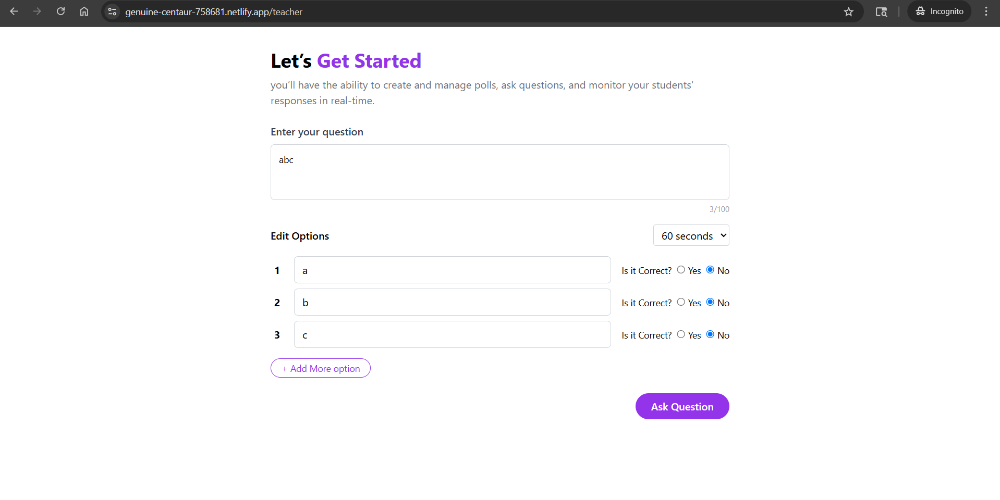

# 🗳️ Live Polling System

A real-time polling platform built with **React**, **Socket.IO**, and **Express.js**. This app supports interactive live polls between two types of users: **Teachers** and **Students**.

---

## 🚀 Features

### 👨‍🏫 Teacher
- ✅ Create new poll questions with configurable duration.
- ✅ View live poll results in real-time.
- ✅ View historical poll results (persisted on server).
- ✅ See participant list.
- ✅ Kick out any student from the session.
- ✅ Interact with students using chat.

### 🧑‍🎓 Student
- ✅ Enter name once per tab (persisted on refresh).
- ✅ Participate in live polls and submit answers.
- ✅ View live poll results after submitting or after timeout.
- ✅ Auto transition to result screen after 60 seconds if not answered.
- ✅ Chat with teacher and others.

---

## 🧑‍💻 Technologies Used

| Tech       | Description                                  |
|------------|----------------------------------------------|
| React      | Frontend library                             |
| Socket.IO  | Real-time WebSocket communication            |
| Express.js | Backend server for socket handling           |
| TailwindCSS| Styling the application                      |
| Redux      | (Optional) State management for poll/chat    |

---

## 📸 Screenshots

1. **Selection Page Teacher/Student**
   

1. **Poll Creation by Teacher**  
   

2. **Student Answering Poll**  
   

---

## 🏁 How to Run Locally

### 1️⃣ Clone the repo

```bash
git clone https://github.com/Nipunkhattri/polling-system
cd polling-system
```

### Navigate to backend Folder

```bash
cd Backend
npm install
npm run dev
```

### Navigate to Frontend Folder

```bash
cd frontend
npm install
npm start
```

## 4️⃣ Access the App

Open your browser and visit: https://genuine-centaur-758681.netlify.app/
Use different tabs or incognito windows to simulate multiple students and one teacher.

## 🛠️ Data Persistence

- Currently, the app uses **in-memory storage** (JavaScript `Map` and `Set`) to manage:
  - Connected users
  - Poll data
  - Poll history
- This is suitable for demo purposes.
- 📦 In the future, this can be extended to use a **database** (e.g., MongoDB, PostgreSQL) to:
  - Persist poll history
  - Maintain session states
  - Track student participation over time
